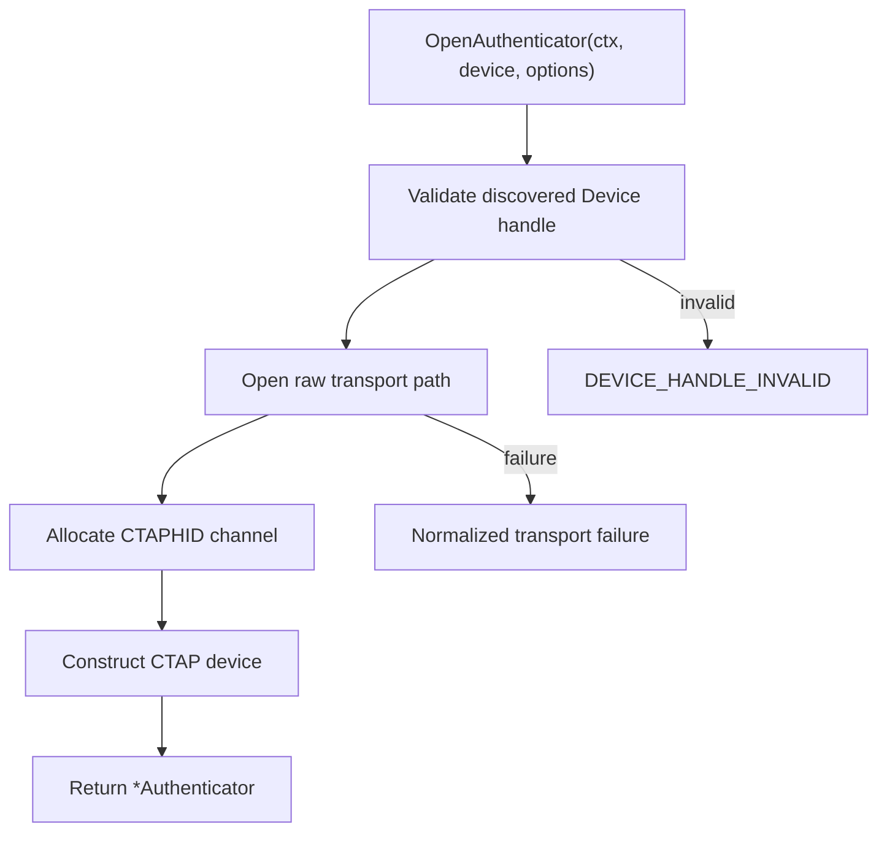
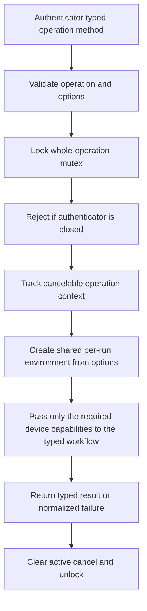
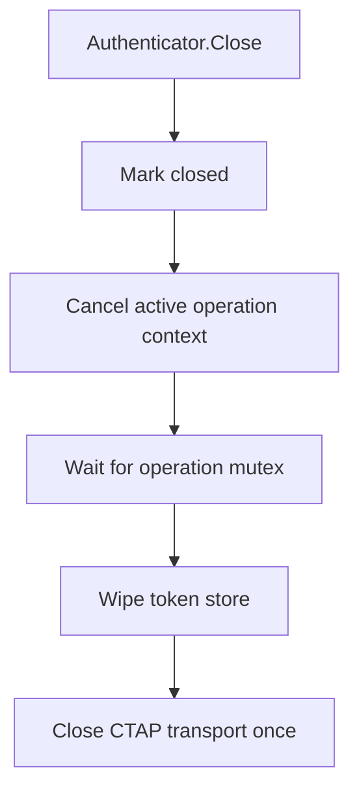

# Current Runtime Flows

This document describes the current runtime boundaries and lifecycle.

## Runtime Entities

The root `ctapkit` package exposes two device concepts:

- `Device` is a lightweight handle from one discovery snapshot. Discovery only
  uses HID or the configured platform proxy and does not open a CTAP channel.
- `Authenticator` is one opened CTAP authenticator channel. It remains open
  while the application has that device selected.

`Authenticator` directly owns the opened device, selected discovery report,
token store, operation mutex, active-operation cancel function, and close
state. There is no public session facade and no separate internal session
core.

## Application Lifecycle

A typical UI uses the runtime as follows:

1. Discover the currently attached devices.
2. Select the first device by default and call `OpenAuthenticator`.
3. Run operations against that authenticator.
4. Close it and open another authenticator when the user changes selection.
5. Close the selected authenticator when the application exits.

Discovery metadata can be enriched independently in the background. A probe
opens its own short-lived CTAPHID channel, reads vendor information, and closes
that channel. CTAPHID channel isolation allows this probe to coexist with the
channel owned by the selected `Authenticator`.

The consuming application may use a selection ID to correlate UI requests,
events, and interactions. That ID is application coordination state; it is not
another runtime session object.

## Open Authenticator

Opening options configure the log journal for the lifetime of the opened
authenticator. Event sinks belong to individual operations.

## Run Operation

The operation mutex prevents multi-command workflows on the same opened
channel from interleaving. It is not a device-wide lease. Other authenticators
and background probes use separate CTAPHID channels and can run concurrently.

The interaction broker is operation-scoped because the handler supplied with
`WithInteractionHandler` and its cancel context belong to one application
request. The token service is also operation-scoped, but it uses the token
store owned by `Authenticator`.

The full opened `authenticator.Device` remains private to `Authenticator` for
lifecycle and token acquisition. It is not stored in the workflow environment.
Each workflow receives only its static capability contract: inspection,
credentials, large blobs, configuration, biometrics, or WebAuthn. Large-blob
workflows intentionally combine credential and large-blob capabilities because
they obtain each credential's `largeBlobKey` from credential inventory.

## Runtime State

The authenticator retains only state that belongs to the opened channel:

- one `pinUvAuthToken` and its permission/RP-ID scope;
- closed state and the active operation cancel function;
- immutable open options and the selected discovery report.

Credential inventories, config reports, and large-blob reports are not cached.
Every operation reads current authenticator state. This avoids stale report
semantics and removes public `refresh` and `prepareInventoryRefresh` controls.

The token store is intentionally different from a report cache. Reusing a
valid token avoids repeated PIN/UV prompts. Every token consumer goes through
one operation-scoped token service, which owns acquisition, callback-copy
wiping, and rejected-token invalidation. Optional consumers first try the
authenticator command without a token. Reads explicitly marked replay-safe are
reacquired and retried once after `PIN_UV_AUTH_INVALID`; mutations are not
replayed. PIN changes, reset, and user-presence rules invalidate or narrow the
stored grant.

## Close And Cancellation

`Close` is safe to call concurrently or repeatedly. It cancels an active
workflow before waiting for the operation mutex, so a pending interaction or
cancel-aware transport command can unwind. A subsequent typed operation method
returns `AUTHENTICATOR_CLOSED`.

## Background Metadata Enrichment

A consuming application may maintain an in-memory metadata cache for the
current discovery topology and a small persistent cache keyed by attachment
fingerprint. A vendor probe accepts the opaque `Device` handle from the same
discovery snapshot; caller-constructed reports cannot be used to open a probe
channel. Probes are short-lived and independent from the selected authenticator:

The current attachment fingerprint is a hash of transport mode and path. A
device moved to another port may therefore create another tiny cache entry.
That duplication is accepted: a hit avoids the much more expensive HID/PCSC
probe, while a miss remains safe and simply refreshes metadata in the
background.

## Safety Properties

- Runtime-owned PIN byte buffers and `pinUvAuthToken` bytes are copied, wiped,
  and never exposed through public results or logs. Public PIN operation DTOs
  also omit PIN fields during JSON encoding.
- Mutations retain preview and dry-run behavior where useful.
- The consuming application owns warnings, confirmation UX, and the decision
  to invoke destructive operations.
- Transport command serialization remains owned by `go-ctaphid`; the kit only
  serializes complete workflows on one opened authenticator.
- Authenticator state is treated as externally mutable between commands.
