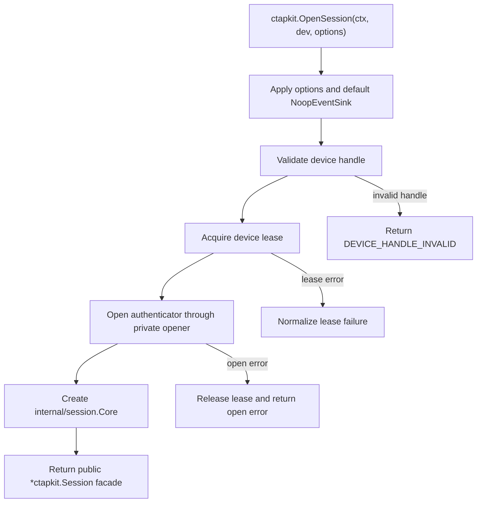
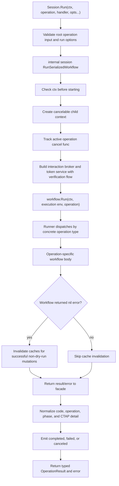
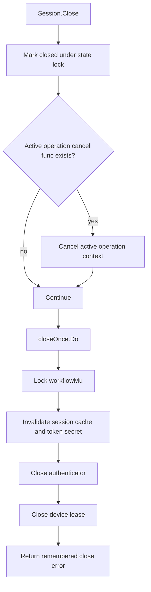
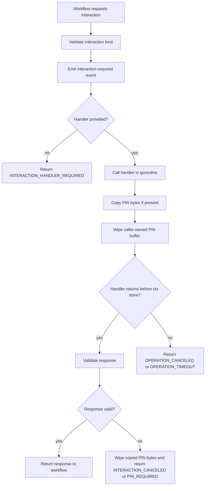
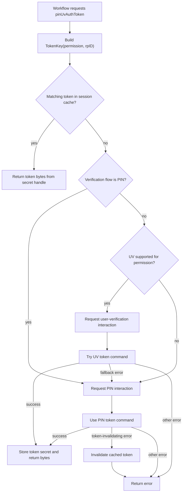

# Current Runtime Flows

This document records how the runtime is structured today. It is intentionally
descriptive: it names current responsibilities, flow ordering, and coupling
points so future refactors can be evaluated against the implementation that
exists now.

It does not propose a replacement design.

## Public Runtime Entrypoints

The root `ctapkit` package is the public runtime facade. Consumers work with
typed `model.Operation` values, a `*ctapkit.Session` handle, optional operation
events, and optional interaction handling.

- `ctapkit.OpenSession` resolves a transport/device selector, acquires a device
  lease, opens the authenticator behind the selected device, and returns a
  public session facade.
- `(*ctapkit.Session).Run` validates root operation input, emits operation
  lifecycle events, runs exactly one typed operation through the serialized
  internal workflow path, normalizes every failure, and returns a typed
  `model.OperationResult`.
- `(*ctapkit.Session).Close` closes the internal session. Close is designed to
  tolerate duplicate or racing calls.
- `(*ctapkit.Session).Info` returns public session metadata derived from the
  selected device and closed state.

## Current Internal Roles

The runtime is split into public packages and private implementation packages.
The public `Session.Run` entrypoint is still a single execution boundary, but
private runtime policies are no longer exposed to workflow code through the
whole internal session object.

- The public facade session in `session.go` owns the public API shape and event
  lifecycle around each operation.
- `internal/session.Core` owns the device lease, opened authenticator, selected
  device metadata, event dispatcher, session cache, closed state, active
  workflow cancellation, close-once behavior, and per-session workflow
  serialization.
- `internal/runtime.InteractionBroker` owns interaction event emission, handler
  dispatch, cancellation, and PIN copy/wipe behavior.
- `internal/runtime.TokenService` owns UV/PIN token acquisition, token cache
  lookup/storage, and auth-error token invalidation.
- `internal/workflow.Runner` owns operation dispatch and operation-specific
  read, preview, and mutation logic over a narrow execution environment.
- The authenticator abstraction in `internal/authenticator` groups the CTAP
  capabilities used by workflows: lifecycle, info, token, credential
  management, large-blob management, configuration, and biometric enrollment.
- Device leases in `device` represent ownership of an authenticator identity
  across sessions and processes. The lease is acquired before opening the
  authenticator and released during session close.
- The session cache in `internal/session.Cache` stores session-lifetime
  credential inventory, large-blob list reports, config status, and a single
  token secret keyed by permission and RP ID.
- The event sink is a consumer-provided `model.EventSink`, defaulting to
  `model.NoopEventSink`. Runtime code emits factual operation progress and
  session state stages through an event dispatcher.
- The interaction handler is a per-run `model.InteractionHandler`. Workflows
  request PIN, user-verification, touch, and confirm interactions through the
  interaction broker in the execution environment.

## Open Session Flow

Important ordering:

- The lease is acquired before the authenticator is opened.
- If authenticator opening fails, the lease is closed before returning.
- The public session contains the internal session; consumers never receive the
  internal session directly.

## Run Operation Flow

The public facade owns the outer operation lifecycle events. The workflow layer
owns operation-specific progress events, previews, and mutations. Interaction,
token, and cache policies are accessed through explicit execution-environment
services rather than through the whole session.

## Close And Cancel Flow

Close marks the session closed and cancels the active workflow before it waits
for the workflow lock. This allows close to return even when an interaction
handler is stuck. The actual authenticator and lease close path is protected by
`sync.Once`, so duplicate or racing close calls share the same result.

After close, `RunSerializedWorkflow` rejects new work with the stable
`SESSION_CLOSED` failure code.

## Interaction Flow

Interaction requests carry prompt payload only: kind, message, expected phrase,
permission label, destructive flag, and preview. Session IDs and interaction IDs
are not exposed in the public event or interaction JSON contracts.

PIN responses are copied at the runtime boundary and the caller-owned buffer is
wiped immediately. Workflows that use PIN-derived values are responsible for
wiping their local copies after use.

## Token Acquisition Flow

The token cache stores one token secret at a time. A token is reused only when
the requested permission and RP ID match the cached key. Token invalidation is
triggered by specific auth-invalid or unauthorized-permission style failures,
and by successful mutations that make cached tokens unsafe to reuse.

The default verification flow prefers UV when supported. A per-run PIN
verification flow skips UV interaction and the UV token command, then requests
PIN directly. User-verification interaction is a pre-command human prompt and
cancel point; it does not assert that UV succeeded.

## Operation Skeletons

### Inspect, Status, And Read-Only Operations

- `InspectOperation` reads selected device identity and authenticator info, and
  returns an inspect result.
- `ConfigStatusOperation` returns cached config status when available.
  Otherwise it builds status from authenticator info and augments it with PIN
  and UV retry state where supported.
- `BioSensorInfoOperation` checks status support, then reads biometric modality
  and fingerprint sensor information.
- `BioListOperation` reads config status, acquires a bio-enrollment token, then
  enumerates biometric enrollments.

### Credential Inventory And Mutations

- `ListCredentialsOperation` returns cached credential inventory when
  available. Otherwise it chooses the credential-management permission from
  authenticator info, acquires a token, reads metadata, enumerates RPs and
  credentials, emits enumeration progress, stores private mutation targets for
  the current workflow, and caches the public report.
- `DeleteCredentialOperation` reads fresh inventory state, builds a delete
  preview, returns early for dry-run, requests confirmation if needed, resolves
  the private target, acquires a credential-management token scoped to the
  target RP ID, deletes the credential, and returns a delete result.
- `UpdateCredentialUserOperation` reads fresh inventory state, builds and
  returns an update preview for dry-run, confirms if needed, resolves and
  validates the proposed user update, acquires a credential-management token
  scoped to the target RP ID, updates user information, and returns the previous
  and current public user values.

Credential inventory state contains private CTAP descriptors, user entities,
and large-blob keys. Those values are kept out of public reports and are wiped
when the workflow is done with them.

### WebAuthn Registration And Assertions

- `MakeCredentialOperation` validates public WebAuthn facade input, builds a
  non-destructive mutation preview, returns early for dry-run, confirms if
  needed, acquires a make-credential token scoped to the RP ID when UV is
  requested or the authenticator requires one, calls the authenticator
  MakeCredential command through `go-ctaphid`, and returns public attestation
  artifacts as hex-encoded fields.
- `GetAssertionOperation` validates RP ID, client data, and allow-list
  descriptors, acquires a get-assertion token scoped to the RP ID only when UV
  is requested, drains all assertion responses from the authenticator iterator,
  and returns them in authenticator order.

The v1 WebAuthn runtime facade accepts raw `clientDataJSON` because the pinned
`go-ctaphid` device API hashes that value internally. Public DTOs do not expose
`go-ctaphid` structs, extension inputs/outputs, or `pinUvAuthToken` bytes.

### Large Blob Read, List, And Mutations

- `ReadLargeBlobOperation` reads credential inventory, finds the target
  credential, checks large-blob support and key availability, reads the
  authenticator large-blob array when needed, decrypts matching candidates, and
  returns raw/decode information only for the selected credential.
- `ListLargeBlobsOperation` returns cached list output when available.
  Otherwise it reads credential inventory, optionally reads the large-blob
  array, attempts to match array entries to credentials with available keys, and
  caches the public list report.
- `WriteLargeBlobOperation` reads inventory, loads target blob state, builds a
  preview, returns early for dry-run, confirms if needed, builds a replacement
  shared large-blob array, acquires a large-blob-write token, writes the
  replacement array, and returns a mutation result.
- `DeleteLargeBlobOperation` follows the same target-state and confirmation
  flow as write. If no blob exists for the target credential, it returns a
  no-op result without writing the authenticator array.

Large-blob mutations rewrite the authenticator shared serialized large-blob
array. Previews and results include before/after serialized array sizes and
warnings that describe this behavior.

### Authenticator Configuration Mutations

- `ResetFactoryOperation` builds a reset preview, returns dry-run output when
  requested, otherwise confirms if needed, requests touch interaction, runs
  reset, and returns a reset result. Many authenticators require the reset
  command shortly after power-up, so consumers should collect strong UI
  confirmation before reconnecting and then run a confirmed reset promptly.
- `SetPINOperation` and `ChangePINOperation` validate required PIN fields at the
  public facade boundary, build previews from current status, support dry-run,
  confirm if needed, call the authenticator PIN command, and return a PIN
  result.
- `SetAlwaysUVOperation` builds a preview from current status and requested
  target, supports dry-run and confirmation, acquires an authenticator-config
  token, toggles always-UV, and returns the requested/current result.
- `SetMinPINLengthOperation` builds a minimum-PIN-length preview, supports
  dry-run and confirmation, acquires an authenticator-config token, applies the
  new policy, and returns a result.

### Biometric Enrollment And Mutations

- `BioEnrollOperation` builds a preview from current status, supports dry-run
  and confirmation, acquires a bio-enrollment token, starts enrollment, records
  samples, emits `capturing-bio-sample` progress, and attempts to cancel the
  authenticator enrollment if a later sample or context check fails.
- `BioRenameOperation` builds a rename preview, supports dry-run and
  confirmation, decodes the template ID, acquires a bio-enrollment token,
  updates the friendly name, and returns a mutation result.
- `BioRemoveOperation` builds a remove preview, supports dry-run and
  confirmation, decodes the template ID, acquires a bio-enrollment token,
  removes the enrollment, and returns a mutation result.

## Cross-Cutting Behavior

### Context Propagation

Contexts supplied to `DiscoverDevices`, `OpenSession`, and `Session.Run` flow
through discovery, authenticator opening, token acquisition, vendor metadata
probing, and every context-aware CTAP command. This allows cancellation and
deadlines to interrupt transport I/O instead of only stopping between workflow
steps.

Biometric enrollment cleanup is the exception to direct propagation. If the
main enrollment fails or its context is canceled, the runtime attempts
`CancelCurrentEnrollment` with a context derived using `WithoutCancel` and a
two-second timeout. The cleanup context preserves values from the operation but
can outlive its cancellation without blocking session shutdown indefinitely.

### Workflow Serialization

`internal/session.Core.RunSerializedWorkflow` serializes complete logical
runtime operations on one opened session. This is separate from per-command CTAP
serialization in `go-ctaphid`. The runtime lock protects multi-step flows such
as preview, confirmation, token acquisition, mutation, and cache invalidation
from interleaving on the same opened authenticator.

### Cache Ownership And Invalidation

The cache is owned by the internal session and is shared by operations running
on that session. Workflow code reads and populates cache entries through the
execution environment. Successful mutation handlers return explicit effects;
those effects invalidate cache entries only after the operation body returns nil
error.

Successful non-dry-run operations currently return these invalidation effects:

- Credential delete and user update invalidate credential inventory and
  large-blob list reports.
- MakeCredential invalidates credential inventory and large-blob list reports.
- Large-blob write and delete invalidate large-blob list reports.
- PIN, bio, always-UV, and minimum-PIN-length mutations invalidate config
  status.
- Factory reset invalidates all cache state.
- Factory reset, PIN set, and PIN change invalidate any cached token.
- Bio mutations invalidate cached bio-enrollment tokens.
- Authenticator config mutations invalidate cached authenticator-config tokens.

Dry-run operations return no invalidation effects.

### Token Caching And Secret Handling

Token secrets are stored in `secret.Handle` values inside the session cache.
Workflows request tokens from `internal/runtime.TokenService`, receive byte
copies, and defer wiping those copies. PIN bytes received from handlers are
copied and the caller-owned slice is wiped at the interaction boundary.

Root `model` PIN operation DTOs omit PIN fields when marshaled, and public
result DTOs never expose `pinUvAuthToken` values. The Wails-oriented `service`
request DTOs deliberately keep typed PIN fields in JSON; the adapter and client
own transport protection and must redact those fields from logs and persistence.

### Dry-Run And Confirmation Semantics

Mutating operations build previews before executing CTAP mutations. Dry-run
requests return the preview and stop before confirmation, token acquisition for
the mutation, and mutation execution.

Non-dry-run mutations require explicit confirmation unless the operation request
already carries the appropriate confirmation state. Destructive operations use
destructive confirmation metadata in the interaction request. Factory reset uses
a typed phrase check.

### Event Stages

Workflow and session code emit progress or state stages:

- `interaction-required`
- `enumerating-rps`
- `enumerating-credentials`
- `capturing-bio-sample`

The facade does not emit terminal operation result stages. Consumers infer
success, failure, and cancellation from the `Session.Run` result and returned
error.

### Error Normalization

Every public runtime boundary converts a non-nil failure into a
`*failure.Error` with a stable machine-readable `Code`. Device, transport,
session, interaction, cancellation, timeout, and workflow failures all use the
same registry. `Session.Run` also records the public operation and the phase in
which the failure occurred. Consumers match a specific condition with
`failure.IsCode`; `Category` is only a coarse recovery hint.

Authenticator failures include a transport-safe `failure.CTAPDetail`. It
preserves the numeric command, optional subcommand, and status returned by the
authenticator. Numeric values remain authoritative, and symbolic names are
omitted when the kit does not know them. Command-aware normalization maps the
same raw CTAP status to the appropriate semantic code; for example,
`CTAP2_ERR_NO_CREDENTIALS` during GetAssertion becomes
`CREDENTIAL_NOT_FOUND` without losing command `2` or status `46`.

The original low-level cause remains reachable only through the in-process Go
error chain. It is excluded from snapshots and JSON. Service envelopes expose
`failure.Snapshot` under their `error` field. See the
[machine-readable error contract](error-contract.md) for the complete Go and
JSON rules and exact CTAP examples.

### Close And Race Behavior

Close is expected to be safe under duplicate and racing consumer calls. It marks
the session closed, cancels any active workflow, and performs authenticator and
lease close exactly once. Tests cover repeated close, close during active run,
close while an interaction handler is blocked, and run-after-close rejection.

## Coupling Boundary

`internal/session.Core` still owns the opened authenticator and session lifetime
resources, but workflow code no longer receives the whole internal session.
`internal/workflow.Runner` receives an execution environment containing
only selected device metadata, authenticator capabilities, event emission,
interaction dispatch, token service, and cache access.

This keeps lifecycle, lease ownership, close/cancel state, and workflow
serialization out of operation-specific workflow code.
