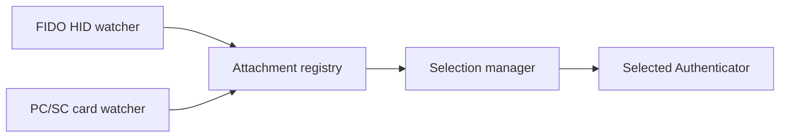
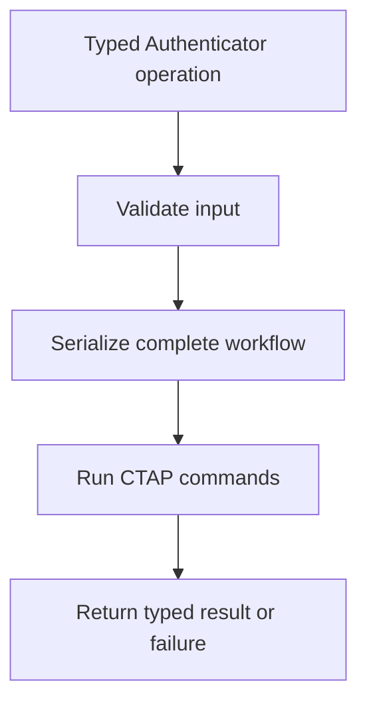

# Current Runtime Flows

## Device manager

`DeviceManager` owns the live attachment registry and the only selected
`Authenticator`.

```mermaid
flowchart LR
  H["FIDO HID watcher"] --> R["Attachment registry"]
  P["PC/SC card watcher"] --> R
  R --> M["Selection manager"]
  M --> A["Selected Authenticator"]
```

The registry contains FIDO HID attachments and every inserted PC/SC card.
Empty readers are not selectable. HID attachments sort before PC/SC cards;
paths and reader names sort lexicographically within their transport.

The manager follows a small set of rules:

- when selection is empty, open the first attachment that has not already
  failed during this connection;
- adding an attachment never replaces the current selection;
- removing the selected attachment closes it before another is opened;
- manual selection closes the old authenticator, tries the target, and falls
  back to the next available attachment if opening fails;
- a failed attachment is not retried until it is removed and connected again,
  or explicitly selected.

Opening and closing are synchronous in the manager event loop. Transport
watchers retain events while an open or close operation is running.

## Authenticator

`Authenticator` owns one CTAP transport channel, operation serialization,
runtime tokens, and private large-blob state. Applications obtain it through
`DeviceManager.Selected` and must not close it directly.

`Authenticator.Close` cancels the active operation, clears runtime-owned
device state, and closes the transport. The manager calls it on selection
changes and shutdown.

## Operation execution

```mermaid
flowchart TD
  A["Typed Authenticator operation"] --> B["Validate input"]
  B --> C["Serialize complete workflow"]
  C --> D["Run CTAP commands"]
  D --> E["Return typed result or failure"]
```

The operation mutex prevents multi-command workflows on one selected
authenticator from interleaving. Transport command serialization remains
owned by `go-ctaphid`.

## Safety

- PINs and authentication tokens are never logged or persisted.
- Closing the selected authenticator cancels pending work and clears
  runtime-owned token state.
- At most one authenticator is owned by a `DeviceManager`.
- The application owns confirmation UX for destructive operations.
