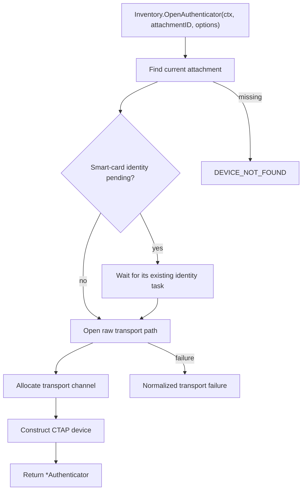
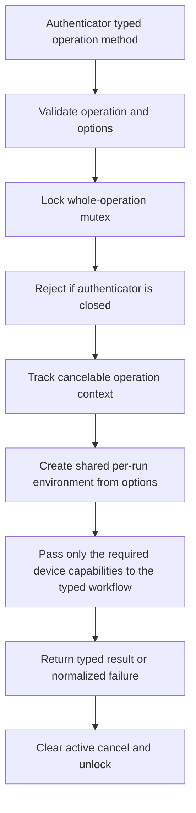
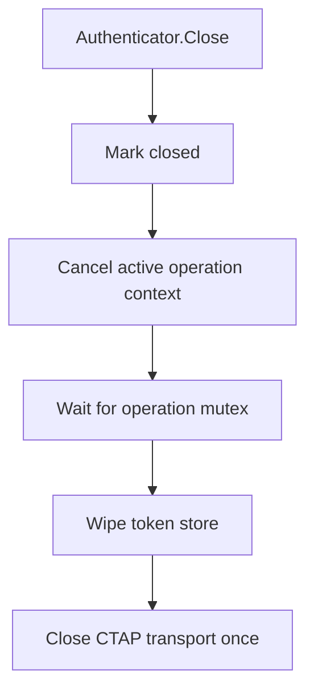

# Current Runtime Flows

This document describes the current runtime boundaries and lifecycle.

## Runtime Entities

The root `ctapkit` package exposes three runtime concepts:

- `Inventory` owns discovery, transport events, attachment topology, and
  progressive hardware-identity resolution for one fixed transport mode.
- `Attachment` is the transport endpoint represented by
  `DeviceReport.Attachment`; its opaque ID depends only on that endpoint.
- `DeviceIdentity` is optional vendor identity resolved independently from the
  attachment and published as an atomic update.
- `Authenticator` is one opened CTAP authenticator channel. It remains open
  while the application has that attachment selected.

`Authenticator` directly owns the opened device, selected discovery report,
token store, operation mutex, active-operation cancel function, and close
state. There is no public session facade and no separate internal session
core.

## Application Lifecycle

A typical UI uses the runtime as follows:

1. Open one `Inventory` for the application's transport mode.
2. Read its snapshot and select the first attachment by default.
3. Call `Inventory.OpenAuthenticator` with that attachment ID.
4. Run operations against that authenticator.
5. Close it and open another authenticator when the user changes selection.
6. Close the selected authenticator and then the inventory when the application exits.

Attachments are published before optional identity is available. The
inventory resolves each attachment once per connection generation through one
bounded queue and emits full typed snapshots. HID authenticators open through
an independent CTAPHID channel without waiting for optional identity. Opening
a pending smart-card attachment promotes and waits for that same task so the
resolver releases its exclusive PC/SC access first. Identity failure does not
prevent CTAP open.

The consuming application may use a selection ID to correlate UI requests,
events, and interactions. That ID is application coordination state; it is not
another runtime session object.

## Open Authenticator

```mermaid
flowchart TD
  A["Inventory.OpenAuthenticator(ctx, attachmentID, options)"] --> B["Find current attachment"]
  B --> C{"Smart-card identity pending?"}
  C -->|yes| D["Wait for its existing identity task"]
  C -->|no| E["Open raw transport path"]
  D --> E
  E --> F["Allocate transport channel"]
  F --> G["Construct CTAP device"]
  G --> H["Return *Authenticator"]

  B -->|missing| X["DEVICE_NOT_FOUND"]
  E -->|failure| Y["Normalized transport failure"]
```

Opening options configure the log journal for the lifetime of the opened
authenticator. Event sinks belong to individual operations.

## Run Operation

```mermaid
flowchart TD
  A["Authenticator typed operation method"] --> B["Validate operation and options"]
  B --> C["Lock whole-operation mutex"]
  C --> D["Reject if authenticator is closed"]
  D --> E["Track cancelable operation context"]
  E --> F["Create shared per-run environment from options"]
  F --> G["Pass only the required device capabilities to the typed workflow"]
  G --> H["Return typed result or normalized failure"]
  H --> I["Clear active cancel and unlock"]
```

The operation mutex prevents multi-command workflows on the same opened
channel from interleaving. It is not a device-wide lease. Other authenticators
and HID inventory identity tasks use separate CTAPHID channels and can run
concurrently.

The interaction broker is operation-scoped because the handler supplied with
`WithInteractionHandler` and its cancel context belong to one application
request. The token service is also operation-scoped, but it uses the token
store owned by `Authenticator`.

The full opened `authenticator.Device` remains private to `Authenticator` for
lifecycle and token acquisition. It is not stored in the workflow environment.
Each workflow receives only its static capability contract: inspection,
credentials, large blobs, configuration, biometrics, or WebAuthn. Large-blob
workflows intentionally combine credential and large-blob capabilities because
they obtain each credential's `largeBlobKey` from credential inventory.

## Runtime State

The authenticator retains only state that belongs to the opened channel:

- one `pinUvAuthToken` and its permission/RP-ID scope;
- one private large-blob snapshot containing the credential keys and blob
  array used by large-blob workflows;
- closed state and the active operation cancel function;
- immutable open options and the device snapshot captured at open.

Credential inventories and config reports are not cached. Large-blob workflows
are the deliberate exception: `ListLargeBlobs` refreshes the private snapshot,
while read, preview, and mutation operations reuse it. Successful large-blob
mutations synchronize the retained blob array. Credential mutations, WebAuthn
large-blob writes, and reset record state effects that invalidate the snapshot;
the next large-blob operation reloads both credential keys and blobs. An
uncertain mutating-command failure also invalidates it, while dry runs and
no-ops do not.

The token store is intentionally different from a report cache. Reusing a
valid token avoids repeated PIN/UV prompts. Every token consumer goes through
one operation-scoped token service, which owns acquisition, callback-copy
wiping, and rejected-token invalidation. Optional consumers first try the
authenticator command without a token. Reads explicitly marked replay-safe are
reacquired and retried once after `PIN_UV_AUTH_INVALID`; mutations are not
replayed. PIN changes, reset, and user-presence rules invalidate or narrow the
stored grant.

## Close And Cancellation

```mermaid
flowchart TD
  A["Authenticator.Close"] --> B["Mark closed"]
  B --> C["Cancel active operation context"]
  C --> D["Wait for operation mutex"]
  D --> E["Wipe token store"]
  E --> F["Close CTAP transport once"]
```

`Close` is safe to call concurrently or repeatedly. It cancels an active
workflow before waiting for the operation mutex, so a pending interaction or
cancel-aware transport command can unwind. A subsequent typed operation method
returns `AUTHENTICATOR_CLOSED`.

## Progressive Device Identity

Identity is runtime state owned by `Inventory`; applications neither merge nor
persist it:

```mermaid
flowchart LR
  A["Transport discovery"] --> B["Publish attachment snapshot"]
  B --> C["Queue one resolver task for connection generation"]
  C --> D["Collect exact correlation evidence"]
  D --> E["Return one atomic DeviceIdentity"]
  E --> F["Publish full identity snapshot"]
```

`AttachmentID` is stable across identity updates and never contains the vendor
serial. Removal cancels the resolver task and its generation guard rejects late
results. Identity is resolved again after reinsertion and is never read from or
written to a persistent cache. Token2 correlation accepts only exact serial,
USB parent/instance, or ATR product-and-suffix evidence; ambiguity produces an
unavailable identity rather than selecting a convenient candidate.

## Safety Properties

- Runtime-owned PIN byte buffers and `pinUvAuthToken` bytes are copied, wiped,
  and never exposed through public results or logs. Public PIN operation DTOs
  also omit PIN fields during JSON encoding.
- Mutations retain preview and dry-run behavior where useful.
- The consuming application owns warnings, confirmation UX, and the decision
  to invoke destructive operations.
- Transport command serialization remains owned by `go-ctaphid`; the kit only
  serializes complete workflows on one opened authenticator.
- Concurrent mutations by another application are outside the supported usage
  model. State effects keep retained runtime state consistent with mutations
  performed through this runtime; an explicit `ListLargeBlobs` remains the
  caller-controlled refresh point for external changes.
